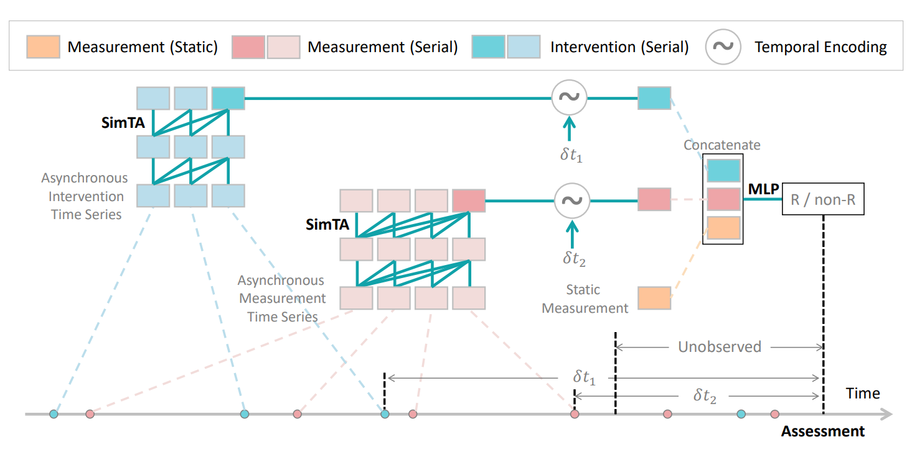

# **Sim**ple **T**emporal **A**ttention (SimTA)

Simple Temporal Attention (SimTA) module is an **attention module** to analyze **asynchronous time series**. 

## Abstract
Predicting clinical outcome is remarkably important but challenging. Research efforts have been paid on seeking significant biomarkers associated with the therapy response or/and patient survival. However, these biomarkers are generally costly and invasive, and possibly dissatifactory for novel therapy. On the other hand, multi-modal, heterogeneous, unaligned temporal data is continuously generated in clinical practice. This paper aims at a unified deep learning approach to predict patient prognosis and therapy response, with easily accessible data, e.g., radiographics, laboratory and clinical information. Prior arts focus on modeling single data modality, or ignore the temporal changes. Importantly, the clinical time series is asynchronous in practice, i.e., recorded with irregular intervals. In this study, we formalize the prognosis modeling as a multi-modal asynchronous time series classification task, and propose a MIA-Prognosis framework with Measurement, Intervention and Assessment (MIA) information to predict therapy response, where a Simple Temporal Attention (SimTA) module is developed to process the asynchronous time series. Experiments on synthetic dataset validate the superiory of SimTA over standard RNN-based approaches. Furthermore, we experiment the proposed method on an in-house, retrospective dataset of real-world non-small cell lung cancer patients under anti-PD-1 immunotherapy. The proposed method achieves promising performance on predicting the immunotherapy response. Notably, our predictive model could further stratify low-risk and high-risk patients in terms of long-term survival.



For more details, please refer to our paper: 

**MIA-Prognosis: A Deep Learning Framework to Predict Therapy Response**

*[Jiancheng Yang](http://jiancheng-yang.com/), Jiajun Chen, [Kaiming Kuang](http://kaimingkuang.github.io/), Tiancheng Lin, [Junjun He](https://scholar.google.com/citations?user=Z4LgebkAAAAJ), [Bingbing Ni](https://scholar.google.com/citations?user=eUbmKwYAAAAJ)*

[DOI](http://doi.org/10.1007/978-3-030-59713-9_21) | [arXiv](https://arxiv.org/abs/2010.04062)

## Code Structure
* SimTA/
    * [`config/`](config/): Training configurations
    * [`dataset/`](dataset/): Toy data generator, PyTorch dataset and toy data pickles used in experiments.
    * [`engine/`](engine/): Keras-like training and evaluation API
    * [`etc/`](etc/): images for README.md
    * [`models/`](models/): PyTorch Implementation of SimTA modules and LSTM model as comparison.
    * [`run/`](/run): Training and evaluation scripts
    * [`utils/`](/utils): Utility functions

## Requirements
```
pytorch>=1.3.0
numpy>=1.18.0
scikit-learn>=0.23.2
tqdm>=4.38.0
```

## Usage
### Training
To train the SimTA model on the toy dataset, run:
```bash
python -m run.main_simta --logdir <logging_directory>
```
Tensorboard logs, configuration files and trained PyTorch models are saved under the `logging_directory` that you specify.
To train LSTM-based approaches for comparison, run:
```bash
python -m run.main_lstm --logdir <logging_directory>
python -m run.main_lstm_time_interval --logdir <logging_directory>
python -m run.main_lstm_time_stamp --logdir <logging_directory>
```

### Evaluation
To evaluate the SimTA model on the toy dataset, run:
```bash
python -m run.main_simta --modelpath <pytorch_model_weights_path>
```
You can load your trained model weights by specifying the `modelpath` argument. A pytorch .pth file path should be provided.
To evaluate LSTM-based approaches for comparison, run:
```bash
python -m run.evaluate_lstm --modelpath <pytorch_model_weights_path>
python -m run.evaluate_lstm_time_interval --modelpath <pytorch_model_weights_path>
python -m run.evaluate_lstm_time_stamp --modelpath <pytorch_model_weights_path>
```

### Generating Toy Data
Since we use in-house clinical dataset that cannot be made public in our paper, we hereby open-source our toy data for proof-of-concept experiments(.pickle files in /dataset) and the code we use to generate it. To generate toy data like we did in our paper, run:
```bash
python -m dataset.generate_toy_data
```
You may find the configuration of toy data in [/dataset/toy_data_cfg.py](/dataset/toy_data_cfg.py) and play with it a little. For concrete details of the toy data settings, please refer to our paper.

## Experiments
Here is a screenshot of the experiment tensorboard logs of SimTA and three LSTM-based approaches used in our paper:

On the toy dataset, SimTA has a much better performance compared with LSTM-based approaches in terms of mean squared error in the regression task.
